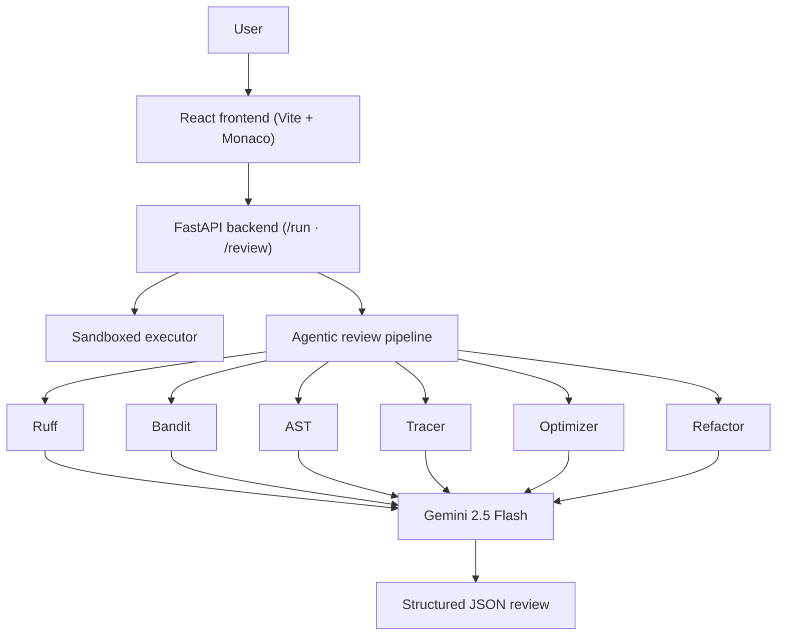

# DSA Visualizer Pro

An interactive, web-based algorithm playground and IDE with step-by-step DSA visualizations and an agentic AI code review system powered by Gemini 2.5 Flash.

---

## What it does

DSA Visualizer Pro combines three things in one tool:

- A full Python IDE (Monaco Editor) with sandboxed execution and live stdout/stderr capture
- Real-time visualizers for sorting algorithms and core data structures (Stack, Queue, Linked List)
- An agentic AI review pipeline that runs six specialized analysis tools before producing a structured, tab-based code review inside the editor

---

## Key features

### Python playground IDE
- Monaco Editor with autocomplete, bracket matching, and theme support
- Safe sandboxed execution for any 0-argument Python script
- Captures stdout, stderr, and runtime trace metrics

### Agentic AI code review
The review pipeline orchestrates six tools in parallel before calling Gemini:

| Tool | What it checks |
|---|---|
| Ruff | Syntax errors and lint violations |
| Bandit | Security vulnerabilities (LOW / MEDIUM / HIGH) |
| AST | Static Big-O time and space complexity |
| Tracer | Runtime swap and comparison counters |
| Optimizer | Suggests more efficient rewrites |
| Refactor | Readability and naming improvements |

Results surface inside the editor as:
- Gutter severity markers (error / warning / info) with squiggle underlines
- Hover tooltip cards with line-specific feedback and code snippets
- Five review tabs: **Review · Security · Complexity · Optimized · Annotated**
- One-click "Replace Current Code" action from the Optimized tab

### DSA visualizers
- Sorting: Bubble, Selection, Insertion, Merge, Quick — with speed controls and comparison metrics
- Data structures: Stack, Queue, Linked List with push/pop/enqueue/dequeue/insert/delete animations

---

## Technical highlights

These are the parts that took the most engineering effort:

- **Custom execution tracer** — uses `sys.settrace` and an `ObservableArray` wrapper to capture per-step comparisons and swaps without modifying user code
- **Async orchestration** — all six review tools run concurrently via FastAPI's async layer; total review latency stays low even with Bandit and Ruff running together
- **Prompt engineering** — the Gemini call receives pre-structured tool outputs in a schema-constrained format, ensuring the JSON review response maps cleanly to the five frontend tabs
- **Monaco decorations API** — gutter icons and inline squiggles are applied using Monaco's `deltaDecorations` with custom CSS classes, not overlaid HTML

---

## System architecture



---

## Technology stack

| Layer | Technologies |
|---|---|
| Frontend | React 18, Vite, Monaco Editor, Custom CSS variables |
| Backend | FastAPI, Uvicorn, google-genai SDK |
| AI | Gemini 2.5 Flash (orchestrator + reviewer) |
| Static analysis | Ruff, Bandit, Python AST module |
| Runtime tracing | Custom `sys.settrace` instrumentation |

---

## Project structure
DSA_Visualiser/
│
├── backend/
│   ├── agent/
│   │   ├── llm_client.py       # Gemini client with model fallback
│   │   ├── prompts.py          # System instructions and output schemas
│   │   └── review_agent.py     # Tool orchestrator
│   ├── analysis/               # AST complexity and static metrics
│   ├── executor.py             # Sandboxed Python runner
│   ├── main.py                 # API routes (/run, /review)
│   └── requirements.txt
│
├── frontend/
│   ├── src/
│   │   ├── ai-review/          # ReviewPanel and Monaco gutter overlays
│   │   ├── components/         # Sorting, Stack, Queue visualizers
│   │   ├── App.jsx             # Main workspace layout
│   │   ├── index.css           # Design tokens and dark mode
│   │   └── main.jsx
│   ├── package.json
│   └── vite.config.js            
---

## Setup

### Prerequisites
- Python 3.10+
- Node.js 18+
- A [Gemini API key](https://aistudio.google.com/app/apikey)

### 1. Backend

```bash
cd backend

# Activate the virtual environment
..\dsavisualizer\Scripts\activate     # Windows
source ../dsavisualizer/bin/activate   # macOS / Linux

# Install dependencies
pip install -r requirements.txt
```

Create a `.env` file inside `backend/`:

```env
GEMINI_API_KEY=your_gemini_api_key_here
```

Start the server:

```bash
python -m uvicorn main:app --host 127.0.0.1 --port 8000 --reload
```

### 2. Frontend

```bash
cd frontend
npm install
npm run dev
```

Open `http://localhost:5173` in your browser.

---

## Roadmap

- [ ] User accounts with saved code history
- [ ] Tree and graph visualizers (BFS, DFS, Dijkstra)
- [ ] Side-by-side algorithm comparison mode
- [ ] Export review report as PDF
- [ ] Expanded language support beyond Python
